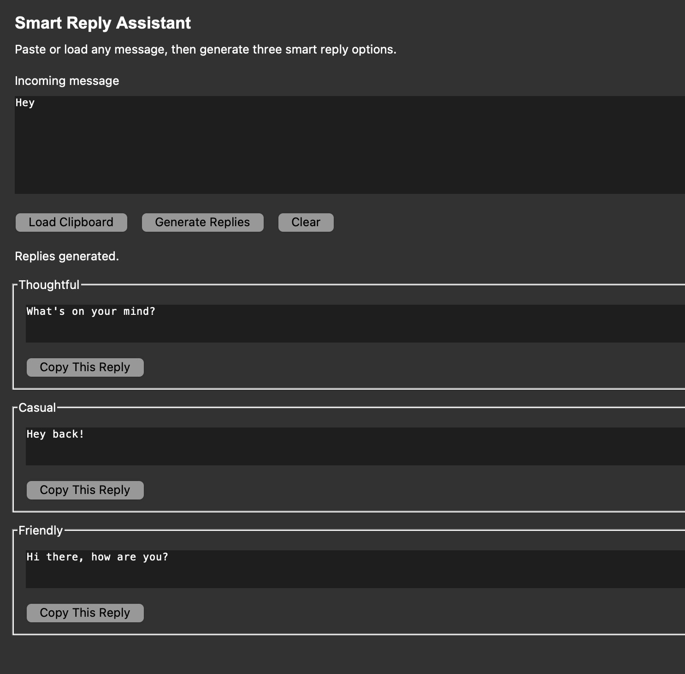

# Smart Reply Assistant

A lightweight macOS desktop app that generates smart, human-like replies for any conversation using a local LLM.

This tool acts as a smart reply assistant (not an auto-bot), helping you quickly craft context-aware responses for chats, messages, emails, and more.

---

## Features

- Works for any conversation:
  - Messaging apps
  - Emails
  - Social media chats
  - General communication 
- Uses a **local LLM (Ollama)** - no API cost or rate limits  
- Simple Tkinter-based UI  
- Clipboard support for quick input  
- One-command startup (auto-starts Ollama)  
- Fully local - no data leaves your machine  

---

## UI Preview

<p align="center">
  
</p>

---

## How It Works

1. Copy any message (from phone or browser)
2. Open the app on your Mac
3. Paste or load clipboard
4. Click Generate Replies
5. Choose a reply → copy → paste anywhere

---

## Tech Stack

- Python (Tkinter)
- Ollama (local LLM runtime)
- LLaMA 3
- Requests (HTTP client)

---

## Setup

### 1. Clone the repo
```bash
git clone <your-repo-url>
cd reply-assistant
```

### 2. Create virtual environment
```bash
python3 -m venv .venv
source .venv/bin/activate
```

### 3. Install dependencies
```bash
pip install -r requirements.txt
```

### 4. Install Ollama
```bash
brew install ollama
```

### 5. Pull a model
```bash
ollama pull llama3
```

---

## Run the app
```bash
python3 app.py
```
This will:
- start Ollama automatically
- launch the desktop app

## 📂 Project Structure

```text
smart-reply-assistant/
├── app.py              # UI + app logic
├── llm_client.py       # LLM integration (Ollama)
├── prompts.py          # Prompt design
├── requirements.txt
└── .gitignore
```

---

## Notes

- This app **does not automate sending messages**
- It is designed as a **manual assistant**
- Keeps usage safe and avoids platform restrictions
- Works best with short conversational inputs

---

## Future Improvements

- Global hotkey (generate replies instantly)
- Menu bar macOS app
- Personalization (tone/style based on user)
- Conversation memory
- Faster streaming responses

---

## Author

Naitik Shah  
Master’s in Computer Science - Oregon State University  

---

## ⭐ Why This Project

Built to explore:
- Local LLM integration
- Desktop app UX
- Prompt engineering
- Practical AI tooling
